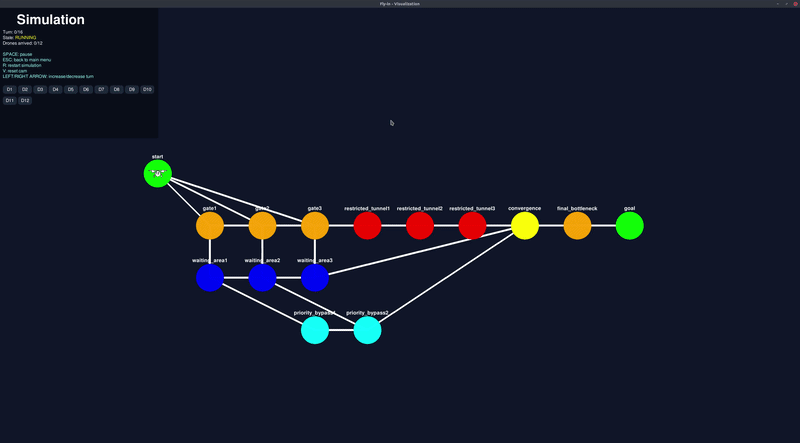

*This project has been created as part of the 42 curriculum by equentin*


# Description
Goal of the project:
Design an efficient drone routing system that navigates multiple drones
through connected zones while minimizing simulation turns and handling movement
constraints.

I used pygame for visualization and implemented a A* algorithm for path-finding.

### How to Create a Custom Map
You can easily create your own maps.  
Add a .txt file in a category of the maps/ directory following this strict format:  
1. Mandatory Rules:  
The very first line must be nb_drones: <positive_integer>.  
You must define exactly one start_hub and one end_hub.  
Hub names must be printable characters and cannot contain dashes (-).  
2. Core Syntax:  
**Hub definition:** \<type>: \<name> \<x> \<y> [metadata] (Types: `start_hub`, `end_hub`, `hub`)  
**Connection:** connection: \<name1>-\<name2> [metadata]  
3. Metadata Options (Inside brackets [...], space-separated):  
zone=\<type> : normal (1 turn), restricted (2 turns), priority (preferred path), blocked (impassable).  
max_drones=\<int> : Hub capacity (Default: 1. Infinite for start/end hubs).  
max_link_capacity=\<int> : Connection capacity (Default: 1).  
color=\<string> : Visual node color for the UI (e.g., red, blue, magenta).  

Example:  
```
# Example map
nb_drones: 5

start_hub: base 0 0 [color=blue]
hub: bottleneck 5 5 [zone=restricted color=orange]
end_hub: goal 10 10 [color=green]

connection: base-bottleneck [max_link_capacity=2]
connection: bottleneck-goal
```
# Instructions

install uv:  
```sh
curl -LsSf https://astral.sh/uv/install.sh | less
```

sync the project dependencies
```sh
make install
```

run the project
```sh
make run
```
*optional*  
run the project with the bypass flag (to override the value restriction)
```sh
make run-bypass-limits
```

**useful**  
check flake8 and mypy:
```sh
make lint
```
or
```sh
make lint-strict
```
clean cache dirs:
```sh
make clean
```
run test file:
```sh
make test
```
run with pdb to debug:
```sh
make debug
```


# Resources
[pytest doc](https://docs.pytest.org/)  
[dijkstra algo](https://www.datacamp.com/fr/tutorial/dijkstra-algorithm-in-python)  
[A* algo](https://en.wikipedia.org/wiki/A*_search_algorithm)  
[itertools doc](https://www.docstring.fr/blog/le-module-itertools/)  
[pygame doc](https://www.pygame.org/docs/)

AI usage: Algorithm implementation and comprehension, main menu, general best practices. Review of README

# Description of the Algorithm
This project uses a decoupled algorithm known as Cooperative A*, operating on a Space-Time Graph.
Drones are routed sequentially. The algorithm relies on:

 - Time-Expanded Graph (3rd Dimension): Standard A* looks for a path from Node A to Node B. Our algorithm looks for a path from (Node A, Turn 0) to (Node B, Turn T). This temporal dimension allows drones to actively choose to "wait" in place to let another drone pass, or to avoid upcoming congestion

 - The Reservation Table: Every time a drone successfully finds a path, its movements are logged into a global state. When routing the next drones, this table acts as an arbiter, treating previously routed drones as dynamic obstacles to strictly respect the max_drones and max_link_capacity constraints at any given turn T

 - True-Distance Heuristic: A reverse Dijkstra algorithm flows backward from the end_hub to pre-compute the exact distance of every node. This ensures the A* algorithm instantly ignores physical dead-ends.

# Documentation of the visualizer
The simulation features an interactive 2D graphical interface, built with pygame.

It implements a state-machine architecture to ensure seamless transitions between the menu and the simulation without performance drops.  

### Features & UX Enhancements
**Dynamic Map Menu (Categorization)**  
Feature: The VMenu automatically parses the maps/ directory and visually groups files into clickable categories.  
UX Enhancement: Users don't need to type file paths in the CLI. They can seamlessly browse, select, and load different scenarios (Easy, Hard, Challenger) through a modern interface.

**Responsive Canvas (Auto-Fit & Free Camera)**  
Feature: Upon loading, the _center_and_fit_map algorithm calculates the map's bounding box to automatically scale and center the network. Users can then freely Pan (Mouse Drag) and Zoom (Mouse Wheel).  
UX Enhancement: Ensures that both microscopic 3-node maps and massive, spread-out networks ("The Impossible Dream") are immediately readable without requiring manual configuration.

**Granular Timeline Controls**  
Feature: The simulation detaches from a fixed real-time loop, offering a floating-point timeline (cur_turn). Users can Pause (SPACE), Restart (R), or manually scrub backward and forward through time (LEFT/RIGHT Arrows).  
UX Enhancement: Essential for algorithmic debugging. It allows peers to freeze time during a massive bottleneck and advance turn-by-turn to verify that routing constraints (max_drones, max_link_capacity) are strictly respected.

**Individual Drone Isolation (Tracking System)**  
Feature: A dynamic button grid at the bottom-left allows the user to click on any specific drone (e.g., D1, D2) to isolate its rendering (self.visible_drone).  
UX Enhancement: Solves the critical "overlapping" issue in Multi-Agent Pathfinding. When 50 drones share the same restricted corridor, the user can isolate a single drone to understand its specific pathing choices without visual clutter.

**Real-Time HUD & Smooth Interpolation**  
Feature: A transparent Heads-Up Display tracks global progress (current turn, arrived drones, running state). Drone movements between nodes are visually interpolated (Linear Interpolation) based on the progress float.  
UX Enhancement: Prevents visual fatigue from "teleporting" sprites and gives the user immediate feedback on the overall success of the pathfinding algorithm.
